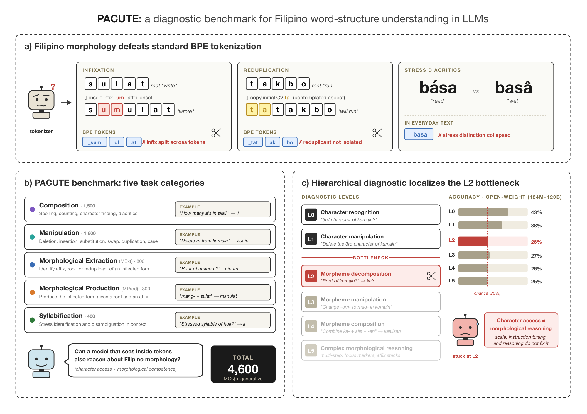

# PACUTE — Filipino Morphology Benchmark

[](https://arxiv.org/abs/2506.XXXXX)
[](LICENSE)
[](https://www.python.org/)

**PACUTE** (**P**honology-, **A**ffix-, and **C**haracter-level **U**nderstanding of **T**okens **E**valuation) is a diagnostic benchmark of 4,600 tasks designed to evaluate morphological understanding in Filipino — a language characterized by productive infixation, reduplication, and diacritic-driven lexical distinctions. This repository contains the benchmark data, evaluation code, and cluster submission scripts used in the paper.



> **(A)** Filipino morphology poses challenges for standard tokenizers: infixes split roots, reduplication copies syllables, and stress diacritics are typically omitted in text. **(B)** PACUTE comprises four task categories targeting different levels of word structure understanding. **(C)** A six-level hierarchical diagnostic localizes failures: models show above-chance performance on character-level tasks (L0–L1) but collapse to chance on morpheme decomposition (L2), with downstream levels inheriting this failure regardless of scale.

---

## Key Findings

- **Open-weight models collapse to chance on morpheme decomposition.** Normalized accuracy on Hierarchical-MCQ ranges from −3.6 to +2.9 across 32 open-weight variants, regardless of scale.
- **Frontier models solve character-level controls** (MDA: 99.4–100.0% CM; LangGame: 94.9–100.0%; Manipulation up to 100.0%) but remain well below ceiling on Filipino morphology.
- **Hierarchical transformations are the persistent bottleneck.** Best: GPT-5.5 at 64.7% EM / 77.5% CM — versus 100.0% CM on the character-level Manipulation task.
- **Syllabification exposes a separate phonological weakness.** Best: GPT-5.5 83.0%; many strong models score below 50%.
- **Filipino-relevant pre-training helps below the frontier.** SEA-LION-Qwen-27B outperforms generic Qwen-3.6-27B on Filipino-specific tasks.
- **Human ceiling is substantially above all models** (~90.4% GEN agreement; Fleiss' κ 74.0% GEN / 85.5% MCQ).

---

## Benchmarks

### Main benchmark

**PACUTE** is the primary benchmark, targeting Filipino morphological and phonological understanding.

| Category | Task | GEN samples | MCQ samples |
|---|---|---|---|
| **PACUTE-Composition** | Character-level composition: spelling, counting, character finding, diacritics | 550 | 950 |
| **PACUTE-Manipulation** | String operations on Filipino words (deletion, insertion, substitution, …) | 800 | 800 |
| **PACUTE-Syllabification** | Stress identification and disambiguation | 200 | 200 |
| **PACUTE-Morphological-Extraction** | Identify affix, root word, or reduplicant of a Filipino word | 400 | 400 |
| **PACUTE-Morphological-Production** | Produce the correctly inflected form given a root word and affix | 150 | 150 |

**Generative (GEN)** is the primary evaluation format: the model produces a free-form answer scored against the ground truth via exact, contains, and prefix match. **Multiple-choice (MCQ)** uses log-probability scoring over a fixed option set — suitable for base pretrained models that cannot reliably follow generation instructions.

### Supplementary benchmark

| Category | Task | GEN samples | MCQ samples |
|---|---|---|---|
| **Hierarchical** | 6-level diagnostic cascade (character → morpheme → composition) | 600 | 600 |

The Hierarchical benchmark structures tasks across six compositional dependency levels, enabling fine-grained diagnosis of where model capabilities break down.

### Reference benchmarks

| Name | Task | GEN samples | MCQ samples | Source |
|---|---|---|---|---|
| **LangGame** | Word-level reasoning (longest, contains letter, starts/ends with …) | 1,000 | 1,000 | Sims et al. (2025) |
| **Multi-digit Addition** | 3-digit arithmetic (tests numeral tokenization) | 1,000 | 1,000 | Sims et al. (2025) |
| **CUTE** | Character-level understanding (spell, insert, delete, swap, sub …) | 1,400 | — | Edman et al. (2024) |

- Sims, A., Foster, T., Kaleb, K., Nguyen, T.-D. H., Lee, J., Foerster, J. N., Teh, Y. W., & Lu, C. (2025). *StochasTok: Improving Fine-Grained Subword Understanding in LLMs.* arXiv:2506.01687.
- Edman, L., Schmid, H., & Fraser, A. (2024). *CUTE: Measuring LLMs' Understanding of Their Tokens.* In Proceedings of EMNLP 2024.

---

## Task Details

### PACUTE-Composition

Tests character-level composition skills — understanding the internal structure of Filipino words without morphological transformations. Samples are drawn from a corpus of Filipino words.

| Subcategory | Description | Example | GEN samples | MCQ samples |
|---|---|---|---|---|
| `spelling` | Spell out a word with spaces between each character | `sila` → `s i l a` | 100 | 100 |
| `character_counting` / `character_counting_exactly` | How many occurrences of a given character are in the word? | How many `a`s in `sila`? → `1` | 100 | 100 |
| `character_counting_most` | Which of four words has the most occurrences of a given character? | Which has the most `a`s? | — | 100 |
| `character_counting_least` | Which of four words has the fewest occurrences of a given character? | Which has the fewest `a`s? | — | 100 |
| `length_counting` | How many characters does the word have? | How many characters in `sila`? → `4` | 100 | 100 |
| `length_counting_most` | Which of four words is the longest? | Which word is longest? | — | 100 |
| `length_counting_least` | Which of four words is the shortest? | Which word is shortest? | — | 100 |
| `diacritic_counting` | How many diacritics (tuldik) does the word contain? | How many diacritics in `silà`? → `1` | 100 | 100 |
| `uppercase_counting` | How many uppercase characters does the word contain? | How many uppercase in `Hindi`? → `1` | 100 | 100 |
| `character_finding` | Which character appears at a given position in the word? | What is the 2nd character of `sila`? → `i` | 50 | 50 |

GEN tasks ask the model to produce a count or character sequence directly. The comparative MCQ-only tasks (`character_counting_most`, `character_counting_least`, `length_counting_most`, `length_counting_least`) do not have a GEN counterpart.

---

### PACUTE-Manipulation

Tests the ability to apply specific character-level transformations to Filipino words. Each sample specifies a target word and the operation to perform. MCQ distractors are generated by applying the correct operation with wrong parameters or a different operation entirely.

| Subcategory | Description | Example | GEN samples | MCQ samples |
|---|---|---|---|---|
| `deletion` | Delete a specified character from the word | Delete `m` from `kumain` → `kuain` | 100 | 100 |
| `insertion` | Insert a character after a specified position | Insert `l` after `u` in `kumain` → `kulmain` | 100 | 100 |
| `substitution` | Replace one character with another | Replace `m` with `l` in `kumain` → `kulain` | 100 | 100 |
| `permutation` | Swap two specified characters | Swap `k` and `m` in `kumain` → `mukain` | 100 | 100 |
| `duplication` | Duplicate a specified character | Duplicate `a` in `kumain` → `kumaain` | 100 | 100 |
| `uppercasing` | Convert the word to uppercase | `kumain` → `KUMAIN` | 100 | 100 |
| `lowercasing` | Convert the word to lowercase | `KUMAIN` → `kumain` | 100 | 100 |
| `diacritic_normalization` | Strip diacritic marks (tuldik) from the word | `kumáin` → `kumain` | 100 | 100 |

---

### PACUTE-Syllabification

Tests phonological and prosodic awareness of Filipino words. Only stress tasks are included; syllable counting and reduplication detection are not part of the current benchmark.

| Subcategory | Description | Example | GEN samples | MCQ samples |
|---|---|---|---|---|
| `stress_identification` | Given sentence context, identify which syllable of the target word carries the stress | *Hindi ito ang huling tren, hindi ba?* — which syllable of `huli` has the stress? → `li` | 100 | 100 (2-option) |
| `stress_disambiguation` | Given sentence context, write the word with the correct diacritic marks (tuldik) | *Pag-asa ang huling namamatay.* — write `huli` with diacritics → `hulí` | 100 | 100 |

Both tasks are context-dependent — they use sentence-level context from a curated corpus to resolve stress ambiguity. The MCQ stress identification task presents only 2 options (the stressed syllable and one other from the same word).

---

### PACUTE-Morphological-Extraction

Tests the ability to identify morphological components of Filipino words. Each sample belongs to one of four subcategories:

| Subcategory | Description | Example | GEN samples | MCQ samples |
|---|---|---|---|---|
| `inflected_affix_extraction` | Identify the affix (prefix, infix, or suffix) used to inflect a word | What is the affix in `uminom`? → `um-` | 100 | 100 |
| `inflected_root_extraction` | Identify the root word of an inflected form | What is the root of `uminom`? → `inom` | 100 | 100 |
| `reduplicated_root_extraction` | Identify the root word of a reduplicated form | What is the root of `mabubuti`? → `buti` | 100 | 100 |
| `reduplicant_extraction` | Identify the repeated segment in a reduplicated word; `none` if not reduplicated | What is the reduplicant in `mabubuti`? → `bu` | 100 | 100 |

`inflected_affix_extraction` samples are stratified across prefix, infix, and suffix (no circumfix). MCQ distractors for affix tasks use Levenshtein similarity against the affix pool; root and reduplicant tasks use character-level perturbations of the correct answer. Labels are normalized at evaluation time (leading/trailing dashes stripped, lowercased).

---

### PACUTE-Morphological-Production

Tests the ability to produce correctly inflected Filipino word forms. All 150 samples belong to the `inflected_form_production` subcategory: given a root word and an affix (with its type), produce the inflected form applying the correct morphophonemic changes (e.g., nasal assimilation, consonant deletion).

| Source | Description | Example | GEN samples | MCQ samples |
|---|---|---|---|---|
| `inflected_form_production` | Root + affix → inflected word | `mang-` + `sulat` → `manulat` | 150 | 150 |

Samples are drawn from the combined `inflected_affix_extraction` and `inflected_root_extraction` corpus rows, deduplicated on (word, root, affix), then sampled from the unique pool. MCQ distractors are character-level perturbations of the correct inflected form.

---

### Hierarchical

A diagnostic benchmark that organizes tasks into 6 compositional levels. Each level builds on the previous, creating a cascade that makes it easy to pinpoint where a model's capabilities break down.

| Level | Capability | Description | Example | GEN samples | MCQ samples |
|---|---|---|---|---|---|
| 0 | Character Recognition | Identify a character at a specific position | "What is the 3rd character in `kumain`?" → `m` | 100 | 100 |
| 1 | Character Manipulation | Perform simple string edits | "Delete the 3rd character in `kumain`" → `kuain` | 100 | 100 |
| 2 | Morpheme Decomposition | Identify morphological boundaries | "What is the root of `kumain`?" → `kain` | 100 | 100 |
| 3 | Morpheme Manipulation | Transform morphological units | "Change `-um-` to `mag-` in `kumain`" → `magkain` | 100 | 100 |
| 4 | Morpheme Composition | Combine morphemes into well-formed words | "Combine `ka-` + `alis` + `-an`" → `kaalisan` | 100 | 100 |
| 5 | Complex Morphological Reasoning | Multi-step linguistic operations | Apply focus markers, combine affixes | 100 | 100 |

Each level has 100 GEN and 100 MCQ samples. If a model fails at level N, failures at N+1 and above are expected due to the compositional dependency structure.

---

### LangGame

Tests subword understanding through word games. Each sample presents 4 candidate words and asks a question about their surface properties. Total of 1,000 samples.

Question types: **most** (most occurrences of a character), **contains** (contains a substring), **starts** (starts with a string), **ends** (ends with a string), **longest** (longest word), **shortest** (shortest word).

Example: *[how, method, need, very] — which word contains `t`?* → `method`

---

### Multi-digit Addition

Simple 3-digit integer addition problems. Primarily probes whether a model's tokenizer correctly handles multi-digit numerals. MCQ distractors are generated using strategically chosen errors (off-by-one, digit swap, carry errors, ±10, ±100). Total of 1,000 samples.

Example: `295+592=` → `887`

---

### CUTE

Character Understanding Tasks Evaluation — 14 task types, 100 samples each, covering a broad range of character-level operations on Filipino and English words.

| Task type | Description | Example answer |
|---|---|---|
| `spell` | Spell out characters with spaces | Spell out `individual` → `i n d i v i d u a l` |
| `spell_inverse` | Reconstruct a word from spelled-out characters | Write the word `b a b y` → `baby` |
| `contains_char` | Does the word contain a given character? | Is there a `u` in `join`? → `No` |
| `contains_word` | Does the word contain a given substring? | Is there `in` in `He asked, with a twinkle in his eye.`? → `Yes` |
| `orth` | Select the word closer in Levenshtein distance | Closer to `career`: `life` or `care`? → `care` |
| `sem` | Select the word more semantically related | More related to `common`: `widespread` or `comment`? → `widespread` |
| `ins_char` | Insert a character after every instance of a given character | Add `t` after every `a` in `states` → `stattes` |
| `ins_word` | Insert a word after every instance of a given word | Add `among` after every `happy` in `She is happy.` → `She is happy among.` |
| `del_char` | Delete every instance of a given character | Delete every `e` in `reviews` → `rviws` |
| `del_word` | Delete every instance of a given word | Delete every `And` in `And they both enjoyed their soup.` → `they both enjoyed their soup.` |
| `sub_char` | Substitute every instance of one character with another | Substitute `a` with `x` in `agency` → `xgency` |
| `sub_word` | Substitute every instance of one word with another | Substitute `each` with `under` in `Tim and Tom look at each other.` → `Tim and Tom look at under other.` |
| `swap_char` | Swap the positions of two characters | Swap `a` and `e` in `added` → `eddad` |
| `swap_word` | Swap the positions of two words | Swap `loved` and `paint` in `Lily loved to paint with her bright colors.` → `Lily paint to loved with her bright colors.` |

---

## Setup

### 1. Configure your environment

```bash
cp .env.example .env
# Edit .env — set PROJECT_ROOT, VENV_PATH, LOGS_PATH, and any API keys
```

The `.env` file is gitignored; never commit it.

Key variables:

| Variable | Description |
|---|---|
| `PROJECT_ROOT` | Absolute path to this repo |
| `VENV_PATH` | Python virtual environment to activate |
| `LOGS_PATH` | Job stdout/stderr and vLLM server logs (default: `$PROJECT_ROOT/logs`) |
| `RESULTS_PATH` | Evaluation outputs — JSON summaries + inference JSONL (default: `$PROJECT_ROOT/results`) |

Optional cluster variables (only needed if your cluster uses environment modules):

| Variable | Description |
|---|---|
| `MODULEFILES_PATH` | Path to pass to `module use` (cluster-specific) |
| `CUDA_MODULE` | Module name to swap in (default: `cuda`) |

### 2. Install the package

**On a SLURM cluster** (one-time setup — must run on a GPU node):

```bash
sbatch scripts/setup_env.slurm
```

This creates `.venv/` with `vllm`, `torch`, `transformers`, and all other dependencies.

**Local / interactive:**

```bash
pip install -e ".[dev]"
```

> vLLM and PyTorch are pinned to specific versions. Local installs on non-GPU machines may need to install PyTorch separately with the appropriate wheel for your hardware.

### 3. Add your models

Edit `configs/models_pt.yaml` (base pretrained) or `configs/models_it.yaml` (instruction-tuned):

```yaml
models:
  my-model-7b-it:
    path: /path/to/my-model        # HuggingFace model path or local directory
    type: it                       # "pt" or "it"
    tokenizer: /path/to/tokenizer  # optional; defaults to path
    thinking: false                # set true for chain-of-thought models
```

---

## Generating benchmarks

Benchmark JSONL files are included in `data/benchmarks/`. To regenerate from the source corpora:

```bash
cd "$PROJECT_ROOT"
python -m pacute_bench.scripts.generate_benchmarks            # all benchmarks
python -m pacute_bench.scripts.generate_benchmarks --benchmarks pacute hierarchical
```

Options:

```
--benchmarks   pacute hierarchical langgame math cute all  (default: all)
--output-dir   data/benchmarks   (default)
--corpora-dir  data/corpora      (default)
--random-seed  1859              (default)
```

---

## Running evaluations

### Interactive / single model

First start a vLLM server, then run the evaluation script:

```bash
vllm serve /path/to/model --port 8000

python -m pacute_bench.scripts.run_evaluation \
    --models my-model-7b-it \
    --vllm-url http://localhost:8000
```

Useful flags:

```
--benchmarks   Override the default benchmark list
--eval-mode    auto | mcq | gen | both   (auto = MCQ-only for pt, both for it)
--max-samples  Cap samples per benchmark (useful for smoke-testing)
--overwrite    Re-run even when inference results already exist
--system-prompt  Override the per-benchmark system prompt
--output-dir   Where to write results (default: results/)
```

### Cluster (SLURM or PBS)

A single submission script handles both schedulers (auto-detected, or set with `--scheduler`):

```bash
# Submit all models (SLURM auto-detected):
bash scripts/submit_evaluations.sh

# PBS cluster:
bash scripts/submit_evaluations.sh --scheduler pbs --queue <your-queue>

# Subset options:
bash scripts/submit_evaluations.sh --it-only
bash scripts/submit_evaluations.sh --model my-model-7b-it
bash scripts/submit_evaluations.sh --dry-run               # preview submit commands
bash scripts/submit_evaluations.sh --overwrite --max-samples 50
bash scripts/submit_evaluations.sh --output-dir /my/results
```

Available flags:

```
--scheduler pbs|slurm  Scheduler (default: auto-detect)
--pt-only / --it-only / --commercial-only   Filter by model type
--model <name>         Submit a single model (repeatable)
--output-dir <path>    Override RESULTS_PATH for this run
--partition <p>        SLURM partition (default: gpu)
--queue <q>            PBS queue (required for PBS)
--walltime <hh:mm:ss>  Job walltime (default: 12:00:00)
--benchmarks <b...>    Only run specific benchmarks
--overwrite            Re-run even when results already exist
--max-samples <n>      Cap samples per benchmark
--filter <pattern>     Only submit models whose name matches pattern
--dry-run              Print submit commands without submitting
```

Each job (`eval_model.slurm` / `eval_model.pbs`):
1. Sources `.env` for `VENV_PATH`, `LOGS_PATH`, and `RESULTS_PATH`
2. Starts a vLLM server (port auto-derived from job ID to avoid collisions)
3. Runs `pacute_bench.scripts.run_evaluation` against it
4. Writes job stdout/stderr to `$LOGS_PATH/<jobid>-<job-name>.out`; vLLM log to `$LOGS_PATH/vllm/<jobid>-<model>.log`
5. Writes evaluation results to `$RESULTS_PATH` (or `$OUTPUT_DIR` if overridden)

GPU count is auto-derived from model path (≥120B → 8, ≥27B → 4, ≥7B → 2, else 1); override with `min_gpus` in the model config YAML.

### Commercial models (OpenAI, Anthropic, Gemini)

Commercial models can be evaluated via their respective batch APIs. Add models to `configs/models_commercial.yaml`:

```yaml
models:
  gpt-4o:
    path: gpt-4o
    type: it
    provider: openai      # openai | anthropic | gemini | xai
```

Set the appropriate API key in `.env`, then run:

```bash
python -m pacute_bench.scripts.run_evaluation \
    --models gpt-4o \
    --eval-mode gen      # MCQ is not supported — batch APIs do not expose log-probabilities
```

> **Note:** Only the GEN format is supported for commercial models. MCQ evaluation requires per-token log-probabilities, which commercial APIs do not expose.

Providers currently supported:

| Provider | Class | Mechanism | Required env var |
|---|---|---|---|
| **OpenAI** | `OpenAIEvaluator` | Batch API | `OPENAI_API_KEY` |
| **Anthropic** | `AnthropicEvaluator` | Message Batches API | `ANTHROPIC_API_KEY` |
| **Gemini** | `GeminiEvaluator` | Google Batch API | `GEMINI_API_KEY` |

To add a new provider, subclass `BatchEvaluator` in `src/pacute_bench/evaluators/` and implement `_submit_batch` and `_try_collect_batch`.

---

## Output structure

```
$RESULTS_PATH/
└── <model-name>/
    ├── evaluation_results.json           # metrics summary
    └── inference/
        ├── pacute-composition-mcq.jsonl  # per-sample predictions
        ├── pacute-morphological-extraction-gen.jsonl
        ├── cute-gen.jsonl
        └── ...

$LOGS_PATH/
├── pb-eval-<model>_<jobid>.out          # SLURM/PBS job stdout/stderr
└── vllm/<jobid>-<model>.log             # vLLM server log
```

### Result format

MCQ result dict:
```json
{
  "accuracy": 0.72, "f1_score": 0.72, "normalized_accuracy": 0.63,
  "num_samples": 400, "format": "mcq",
  "by_category": { "prefix": { "accuracy": 0.80, ... }, ... }
}
```

Generative result dict:
```json
{
  "exact_match": 0.45, "contains_match": 0.61, "prefix_match": 0.52,
  "num_samples": 400, "format": "generative",
  "by_category": { ... }
}
```

---

## Project structure

```
pacute-bench/
├── .env                          # local config (gitignored)
├── .env.example                  # template — commit this
├── configs/
│   ├── evaluation.yaml           # per-benchmark system prompts & answer tags
│   ├── models_it.yaml            # instruction-tuned model registry
│   ├── models_pt.yaml            # pretrained model registry
│   └── models_commercial.yaml    # commercial model registry (OpenAI, Anthropic, Gemini)
├── data/
│   ├── benchmarks/               # generated JSONL evaluation files
│   └── corpora/                  # source data for generation
├── scripts/
│   ├── submit_evaluations.sh     # batch submission (SLURM + PBS, auto-detected)
│   ├── eval_model.slurm          # SLURM job script (single vLLM model)
│   ├── eval_commercial.slurm     # SLURM job script (commercial API models)
│   ├── eval_model.pbs            # PBS equivalents
│   ├── eval_commercial.pbs
│   └── setup_env.slurm           # one-time venv setup on a GPU node
├── src/pacute_bench/
│   ├── evaluators/
│   │   ├── base.py               # BaseEvaluator (shared logic)
│   │   ├── vllm.py               # VLLMEvaluator (self-hosted models)
│   │   ├── batch.py              # BatchEvaluator (abstract base for commercial)
│   │   ├── openai.py             # OpenAIEvaluator
│   │   ├── anthropic.py          # AnthropicEvaluator
│   │   ├── gemini.py             # GeminiEvaluator
│   │   └── xai.py                # XAIEvaluator (xAI Grok, async)
│   ├── generators/               # benchmark dataset generators
│   ├── loaders/                  # benchmark loaders (registry)
│   ├── scripts/
│   │   ├── generate_benchmarks.py        # pacute-generate entry-point
│   │   ├── run_evaluation.py             # pacute-eval entry-point
│   │   ├── sample_human_baseline.py      # stratified sample for human annotation
│   │   ├── generate_annotation_sheets.py # Excel workbooks for annotators
│   │   ├── score_human_baselines.py      # scoring + IAA for filled workbooks
│   │   └── rescore_from_inference.py     # re-aggregate results from inference JSONL
│   └── utils/                    # shared helpers (strings, syllabification …)
└── tests/
```

---

## Human Baseline

Human performance ceilings and inter-annotator agreement (IAA) were collected for the PACUTE benchmarks (composition, manipulation, syllabification, morphological extraction, morphological production) using three independent native Filipino speaker annotators.

**Methodology:**
- Stratified 10% sample per benchmark per format (MCQ and GEN sampled independently), seed=42
- Same items for all 3 annotators (required for IAA)
- Scored with the same pipeline used for models

**IAA metrics:**
- MCQ: Fleiss' κ across 3 annotators
- GEN: percent exact agreement + Fleiss' κ on binarized correct/incorrect ratings

**Scripts** (run from repo root in order):

```bash
# 1. Generate sample
python -m pacute_bench.scripts.sample_human_baseline

# 2. Create Excel workbooks (one per annotator)
python -m pacute_bench.scripts.generate_annotation_sheets --annotators 3

# 3. Score filled workbooks and compute IAA
python -m pacute_bench.scripts.score_human_baselines \
    data/human_baseline_annotations/annotation_annotator1.xlsx \
    data/human_baseline_annotations/annotation_annotator2.xlsx \
    data/human_baseline_annotations/annotation_annotator3.xlsx
```

Outputs written to `results/human_baseline/`: `scores_per_annotator.json`, `iaa.json`, `summary.md`.

---

## Authors

| Name | Affiliation |
|---|---|
| **Jann Railey Montalan** (\*) | AI Singapore · Nanyang Technological University |
| **David Demitri Africa** (\*) | UK AI Security Institute |
| Jimson Paulo Layacan | — |
| Richell Isaiah Flores | Ateneo de Manila University |
| Ivan Yuri De Leon | Ateneo de Manila University |
| Lance Calvin Gamboa | University of Birmingham |

(\*) Equal contribution. Correspondence: [railey@aisingapore.org](mailto:railey@aisingapore.org)

---

## Citation

If you use PACUTE in your research, please cite:

```bibtex
@article{montalan2025pacute,
  title     = {{PACUTE}: Phonology-, Affix-, and Character-level Understanding of Tokens for {Filipino}},
  author    = {Montalan, Jann Railey and Africa, David Demitri and Layacan, Jimson Paulo and
               Flores, Richell Isaiah and {De Leon}, Ivan Yuri and Gamboa, Lance Calvin},
  year      = {2025},
  journal   = {arXiv preprint arXiv:2506.XXXXX},
  url       = {https://arxiv.org/abs/2506.XXXXX},
}
```

---

## License

This repository is released under the [MIT License](LICENSE).
